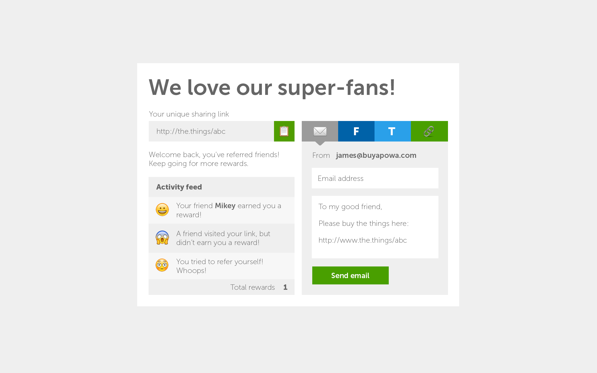

**Background**

As a customer (referrer), I would like to view a page that displays a URL (Share URL)  that I can share to my friends. When my friends use this checkout, I should get a reward and be able to know I have a reward.

**Value**

Customers can refer their friends, get rewards, and be incentivised to refer more friends.

**Expectations**

As this is an exercise, not all features must be implemented fully, use the requirements as a guide to show your working practices and skills. Stop when you feel you have high quality output we can use to see how you work.

We will now describe the components on the page and how they are expected to behave.

**Share Link**

A component that generates a unique share link per customer. The share link component has a button that when clicked copies the share link to the system clipboard.

**A friend page**

A page (not designed) will be shown when a friend clicks on the Share URL. On this page they will be given an option to accept or reject the reward. If the friend accepts the request, this page will have to capture their name.

The actions on this page can inform the content of the activity feed and referral counter on the referrer dashboard page. Consider using local storage or component state to record the actions.
This could be a component within the current page to keep things simple. It does not need to be styled.

**Activity Feed**

The activity feed consists of:

* A notifications section, that displays the latest notification at the top and pushes the rest of the notifications down. Only display three notifications at a time.
* A total rewards section, which displays the total number of rewards awarded for this share link (the total number of friends that clicked accepted the reward).
* You may make this work from some pseudo random data, and emulate an incoming notification

The following notification need to be displayed:

* A notification when a friend accepts the reward along with the friend's name.
* A notification when a friend did not accept the reward.
* A notification when you try to refer yourself.

**Share box**

The share box only needs to implement simple validation to check whether the customer tries to refer themselves by entering their own email address. If this happens a notification should be displayed in the notification area.

You can use create-react-app as a starting point or build a React app from scratch if you prefer.
